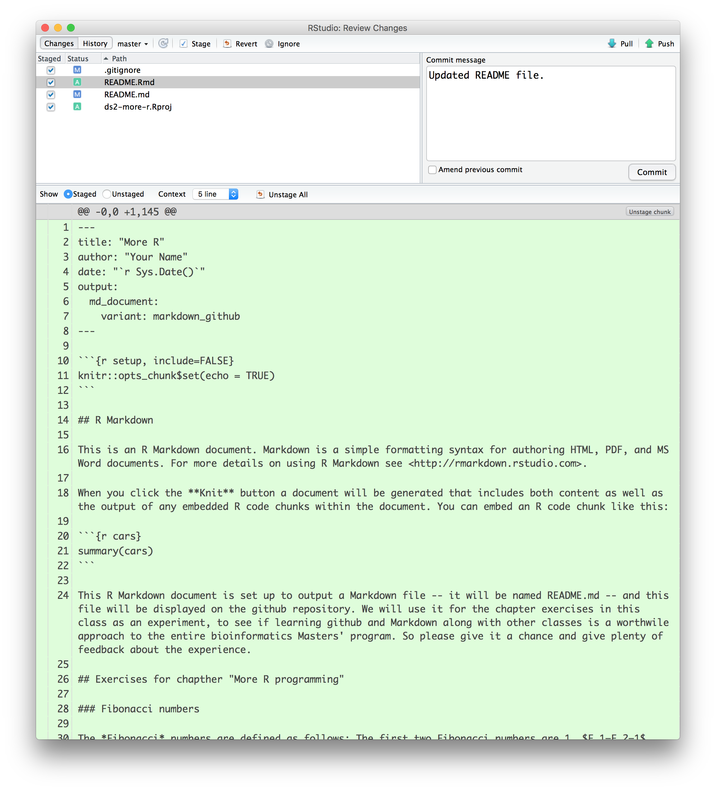

R Markdown
----------

This is an R Markdown document. Markdown is a simple formatting syntax for authoring HTML, PDF, and MS Word documents. For more details on using R Markdown see <http://rmarkdown.rstudio.com>.

When you click the **Knit** button a document will be generated that includes both content as well as the output of any embedded R code chunks within the document. You can embed an R code chunk like this:

``` r
summary(cars)
```

    ##      speed           dist       
    ##  Min.   : 4.0   Min.   :  2.00  
    ##  1st Qu.:12.0   1st Qu.: 26.00  
    ##  Median :15.0   Median : 36.00  
    ##  Mean   :15.4   Mean   : 42.98  
    ##  3rd Qu.:19.0   3rd Qu.: 56.00  
    ##  Max.   :25.0   Max.   :120.00

This R Markdown document is set up to output a Markdown file -- it will be named README.md -- and this file will be displayed on the github repository. We will use it for the chapter exercises in this class as an experiment, to see if learning github and Markdown along with other classes is a worthwile approach to the entire bioinformatics Masters' program. So please give it a chance and give plenty of feedback about the experience.

For the exercises, just update this file and when you are done with the exercises, commit them to git and push the changes to github.

Pushing finished exercises to github
------------------------------------

You can commit and push your changes to github from RStudio. For the exercises in this repository you only need to change this one file, so you shouldn't have to worry about how to add new files -- we can deal with that later. You can see the changes you have made to the repository if you go to the **Git** tab in the upper right corner of RStudio.


Newly added files are marked with `?` -- but you shouldn't see any -- and modified files are marked with `m`. To commit changes you need to *Stage* them. This just means that the staged files are the changes that will be committed next time you commit changes -- git prefers to make commits a two-stage process where you first pick what to commit and then commit it, the first step is staging the files. You can stage the files you want to commit by clicking on the check-boxes in the **Staged** column.


Now, to commit the files, just press the **Commit** button. This opens a window where you can see the changes you are about to commit and you can write a log message for the commit.



After you have committed, the **Git** window will no longer show the changes you commited. If you staged all the modified files, you will have an empty list of changes.


There will be a message just below the toolbar, though, telling you that you are ahead of the `origin/master` branch. When you commit changes you are only modifying your local copy of the repository. You can work on the local copy with all the features provided by git and you can commit as often as you want, but the changes are not pushed upstream to GitHub until you press the **Push** button. This means that you can work on your code in private without having to interact with GitHub until you are ready to push, and then press **Push**. To hand in the exercises for this week, you will eventually have to **Push**, though.

Exercises for chapther "More R programming"
-------------------------------------------

### Fibonacci numbers

The *Fibonacci* numbers are defined as follows: The first two Fibonacci numbers are 1, *F*<sub>1</sub> = *F*<sub>2</sub> = 1. For larger Fibonacci numbers they are defined as *F*<sub>*i*</sub> = *F*<sub>*i* − 1</sub> + *F*<sub>*i* − 2</sub>.

Implement a recursive function that computes the *n*'th Fibonacci number.

The recursive function for Fibonacci numbers is usually quite inefficient because you are recomputing the same numbers several times in the recursive calls. So implement another version that computes the *n*'th Fibonacci number iteratively (that is, start from the bottom and compute the numbers up to *n* without calling recursively).

### Outer product

The outer product of two vectors, **v** and **w**, is a matrix defined as

      v_1 * w_1, v_1 * w_2, v_1 * w_3, v_1 * w_4
      v_2 * w_1, v_2 * w_2, v_2 * w_3, v_2 * w_4
      v_3 * w_1, v_3 * w_2, v_3 * w_3, v_3 * w_4

Write a function that computes the outer product of two vectors.

There actually is a built-in function, `outer`, that you are overwriting here. You can get to it using the name `base::outer` even after you have overwritten it. You can use it to check that your own function is doing the right thing.

#### Solution

``` r
# WRITE YOUR IMPLEMENTATION AND TEST HERE.
```

### Linear time merge

The merge function we used above copies vectors in its recursive calls. This makes it slower than it has to be. Implement a linear time merge function.

Before you start, though, you should be aware of something. If you plan to append to a vector by writing something like

``` r
v <- c(v, element)
```

then you will end up with a quadratic time algorithm again. This is because when you do this, you are actually creating a new vector where you first copy all the elements in the old `v` vector into the first elements and then add the `element` at the end. If you do this *n* times, you have spent on average order *n*<sup>2</sup> per operation. It is because people do something like this in loops, more than the R interpreter, that has given R its reputation for slow loops. You should never append to vectors unless there is no way to avoid it.

In the case of the merge function, we already know how long the result should be, so you can pre-allocate a result vector and copy single elements into it. You can create a vector of length *n* like this:

``` r
n <- 5
v <- vector(length = n)
```

Should you ever need it, you can make a list of length *n* like this

``` r
vector("list", length = n)
```

#### Solution

``` r
# WRITE YOUR IMPLEMENTATION AND TEST HERE.
```

### Binary search

Binary search is a classical algorithm for finding out if an element is contained in a sorted sequence. It is a simple recursive function. The basic case handles a sequence of one element. There you can directly compare the element you are searching for with the element in the sequence to determine if they are the same. If you have more than one element in the sequence, pick the middle one. If it is the element you are searching for, you are done and can return that the element is contained in the sequence. If it is smaller than the element you are searching for then, you know that *if* the element is in the list then it has to be in the last half of the sequence, and you can search there. If it is larger than the element you are searching for, then you know that if it is in the sequence, it must be in the first half of the sequence, and you search recursively there.

If you implement this exactly as described, you have to call recursively with a subsequence. This involves copying that subsequence for the function call which makes the implementation *much* less efficient than it needs to be. Try to implement binary search without this.

#### Solution

``` r
# WRITE YOUR IMPLEMENTATION AND TEST HERE.
```

### More sorting

In the merge sort we implemented above, we solve the sorting problem by splitting a sequence in two, sorting each subsequence, and then merging them. If implemented correctly this algorithm will run in time *O*(*n*log*n*) which is optimal for sorting algorithms if we assume that the only operations we can do on the elements we sort are comparing them.

#### Bucket sort

If the elements we have are all integers between 1 and *n* and we have *m* of them, we can sort them in time *O*(*n* + *m*) using bucket sort instead. This algorithm first creates a vector of counts for each number between 1 and *n*. This takes time *O*(*n*). It then runs through the *m* elements in our sequence, updating the counter for number *i* each time it sees *i*. This runs in time *O*(*m*). Finally, it runs through these numbers from 1 up to *n* and outputting each number, the number of times indicated by the counters, in time *O*(*n* + *m*).

Implement bucket sort.

#### Solution

``` r
# WRITE YOUR IMPLEMENTATION AND TEST HERE.
```

#### Quick sort

Another algorithm that works by recursion, and that runs in expected time *O*(*n*log*n*), is quick sort. It's worst case complexity is actual *O*(*n*<sup>2</sup>) but on average it runs in time *O*(*n*log*n*) and with a smaller overhead than merge sort (if you implement it correctly).

It works as follows: the basis case -- a single element -- is the same as merge sort. When you have more than one element you pick one of the elements in the sequence at random; call it the pivot. Now split the sequence into those elements that are smaller than the pivot, those that are equal to the pivot, and those that are larger. Sort the sequences of smaller and larger elements recursively. Then output all the sorted smaller elements, then the elements equal to the pivot, and then the sorted larger elements.

Implement quick sort.

#### Solution

``` r
# WRITE YOUR IMPLEMENTATION AND TEST HERE.
```

### Selecting the k smallest element

If you have *n* elements, and you want the *k* smallest, an easy solution is to sort the elements and then pick number *k*. This works well and in most cases is easily fast enough, but it is actually possible to do it faster. See, we don't actually need to sort the elements completely, we just need to have the *k* smallest element moved to position *k* in the sequence.

The quick sort algorithm from the previous exercise can be modified to solve this problem. Whenever we split a sequence into those smaller than, equal to, and larger than the pivot, we sort the smaller and larger elements recursively. If we are only interested in finding the element that would eventually end up at position *k* in the sorted lists we don't need to sort the sequence that doesn't overlap this index. If we have *m* &lt; *k* elements smaller than the pivot, we can just put them at the front of the sequence without sorting them. We need them there to make sure that the *k*'th smallest element ends up at the right index, but we don't need them sorted. Similar, if *k* &lt; *m* we don't need to sort the larger elements. If we sorted them, they would all end up at indices larger than *k* and we don't really care about those. Of course, if there are *m* &lt; *k* elements smaller than the pivot and *l* equal to the pivot, with *m* + *l* ≥ *k*, then the *k* smallest element is equal to the pivot, and we can return that.

Implement this algorithm.

#### Solution

``` r
# WRITE YOUR IMPLEMENTATION AND TEST HERE.
```
